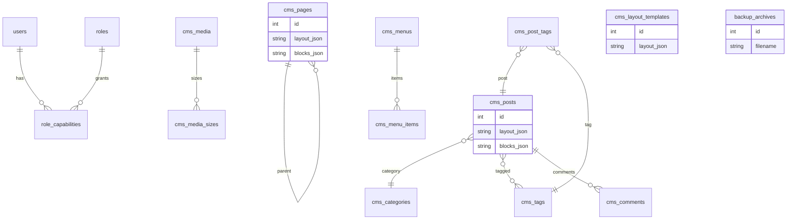

# Simple CMS – Entity relationship (Mermaid)

Active schema is migrations `000`–`018`. Details: [DEVELOPMENTGUIDE.md](DEVELOPMENTGUIDE.md) §5.

Visual layouts are JSON on `cms_pages.layout_json` / `cms_posts.layout_json` (and templates). Compiled CSS is not a table.
