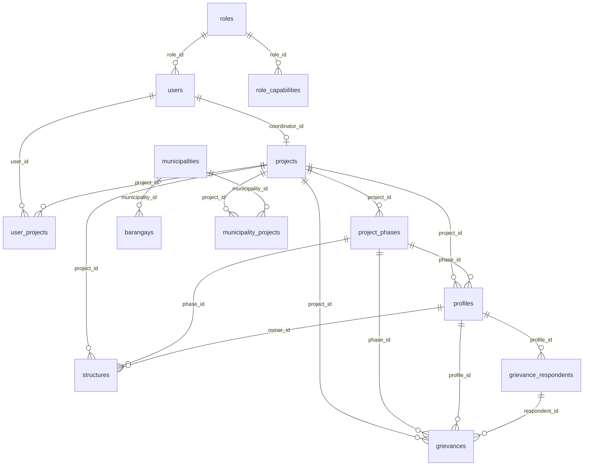
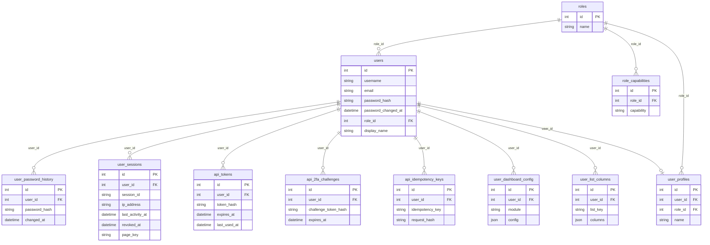
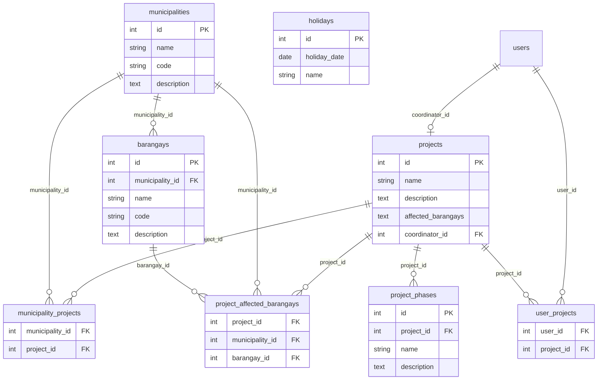
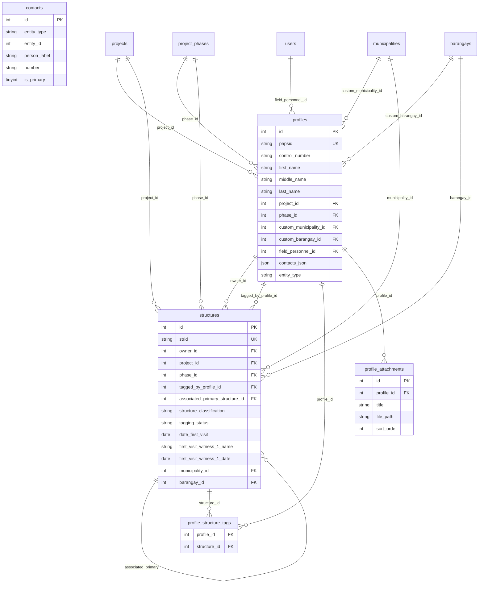
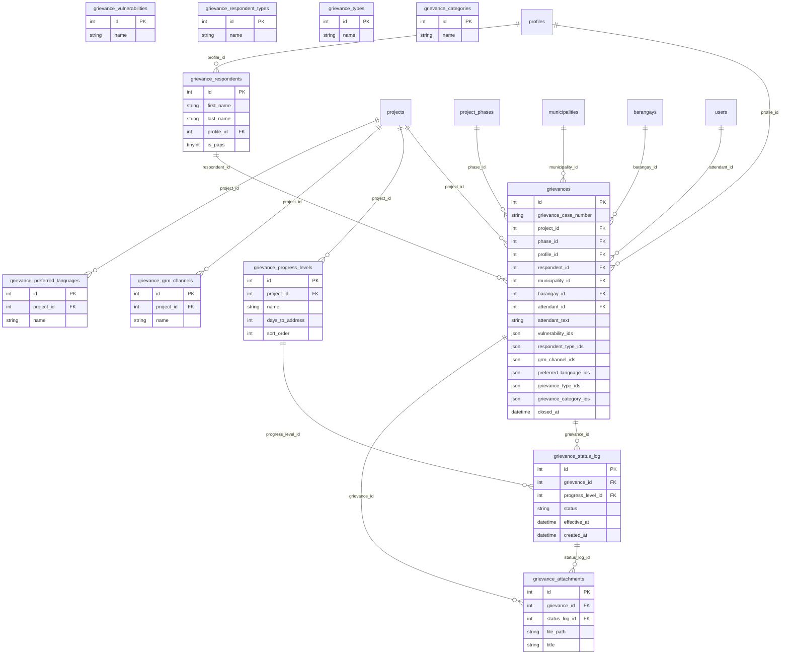
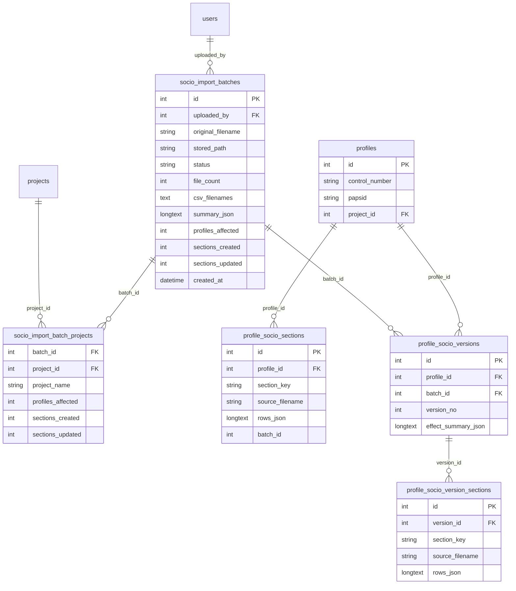
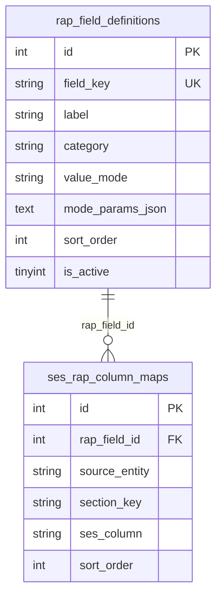
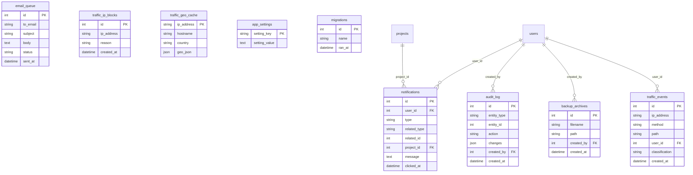

# PAPeR – Entity Relationship Diagram

Logical ERD of the MySQL / MariaDB schema as of migrations **000–091**. Column lists are **key fields only** (not every VARCHAR). Living field detail: [DEVELOPMENTGUIDE.md](DEVELOPMENTGUIDE.md) §4. Binding constraints: [ADR-0003](adr/0003-mysql-mariadb-compatibility.md), [ADR-0008](adr/0008-zip-backup-cli-restore.md). Structure and behaviour (not tables): **[UML.md](UML.md)** / [`/dev-help/#uml`](../dev-help/).

**How to read**

- Solid relationships are real FKs or well-established app joins.
- Dashed / notes mark **logical** links (JSON ID arrays, polymorphic `entity_type` + `entity_id`, or soft references).
- Many core entities carry soft-delete columns (`is_deleted`, `deleted_at`, `deleted_by`) from migration **038** — omitted from diagrams for clarity.
- Full DB dumps (all tables below) are included in ZIP backup/restore.

Render these diagrams in any Mermaid-capable viewer (GitHub, VS Code/Cursor Markdown preview, etc.).

**Live diagrams in the developer guide:** open [`/dev-help/#erd`](../dev-help/) (interactive Mermaid canvas; sources in `dev-help/assets/erd-diagrams.js` — keep that file in sync with this document).

---

## 1. Overview (core domain)

---

## 2. Auth, roles, sessions, API

---

## 3. Projects, location, phases

**Notes:** Municipality/barangay **codes** are unique per linked project (via `municipality_projects`), not globally. `holidays` are org-wide operational calendar rows (no project FK).

---

## 4. Profiles, structures, contacts, attachments

**Contacts:** Polymorphic — `entity_type` is `profile` or `user`, `entity_id` points at `profiles.id` or `users.id` (no single FK). `profiles.contacts_json` / `contact_number` stay denormalized for search.

---

## 5. Grievances and options library

**JSON multi-selects:** `vulnerability_ids`, `respondent_type_ids`, `grm_channel_ids`, `preferred_language_ids`, `grievance_type_ids`, `grievance_category_ids` store arrays of lookup IDs (logical M:N, no junction tables).  
**Project scope:** `grievance_progress_levels`, `grievance_grm_channels`, and `grievance_preferred_languages` use nullable `project_id` (`NULL` = global defaults).  
**Attendant:** either `attendant_id` → `users` or free-text `attendant_text` (mutually exclusive at app level).

---

## 6. Socio-economic (SES) import

ZIP import of SES CSVs into per-profile current sections and version history. **Separate from RAP** (next section). Feature UML: [UML_SES_IMPORT.md](UML_SES_IMPORT.md).

**Notes**

- Import matches CSV CONTROL ID → `profiles.control_number` (not PAPSID; PAPSID is display-only).
- `profile_socio_version_sections` are JSON snapshots by `section_key` (no FK to `profile_socio_sections.id`).
- `source_filename` on current/version sections identifies the CSV inside the ZIP.
- Batch rows also track skip/unmatched counters and optional `error_message` (see migration **084**).
- Main `profiles` columns are never updated by SES import.

---

## 7. RAP mapping

RAP field catalog and multi-source column maps (migrations **089**–**090**). Reads SES / structure / grievance data for project summaries — **does not own** SES import tables.

**Notes**

- Table name `ses_rap_column_maps` is historical; `source_entity` is `ses` | `structure` | `grievance` (logical map into those domains — not a physical FK to SES/structure/grievance rows).
- `value_mode` / `mode_params_json` drive ops such as first, list, sum, average, count, range variants.
- Capabilities: `view_rap_mapping` / `manage_rap_mapping`.

---

## 8. Notifications, audit, backup, traffic, settings

**Polymorphic history:** `audit_log.entity_type` + `entity_id` (and notification `related_*`) point at profiles, structures, grievances, etc., without enforced FKs.

---

## 9. Table inventory (by area)

| Area | Tables |
|------|--------|
| Auth / access | `roles`, `role_capabilities`, `users`, `user_password_history`, `user_sessions`, `user_profiles`, `user_projects`, `user_dashboard_config`, `user_list_columns` |
| API | `api_tokens`, `api_2fa_challenges`, `api_idempotency_keys` |
| Projects / geo | `projects`, `project_phases`, `municipalities`, `barangays`, `municipality_projects`, `project_affected_barangays`, `holidays` |
| Profiles / structures | `profiles`, `structures`, `profile_structure_tags`, `profile_attachments`, `contacts`, structure lookups (`structure_tagging_statuses`, `structure_actual_usages`) |
| Grievance | `grievances`, `grievance_respondents`, `grievance_status_log`, `grievance_attachments`, lookups (`grievance_vulnerabilities`, `grievance_respondent_types`, `grievance_grm_channels`, `grievance_preferred_languages`, `grievance_types`, `grievance_categories`, `grievance_progress_levels`) |
| SES import | `socio_import_batches`, `socio_import_batch_projects`, `profile_socio_sections`, `profile_socio_versions`, `profile_socio_version_sections` |
| RAP mapping | `rap_field_definitions`, `ses_rap_column_maps` |
| Platform | `notifications`, `email_queue`, `audit_log`, `backup_archives`, `traffic_events`, `traffic_ip_blocks`, `traffic_geo_cache`, `app_settings`, `migrations` |

---

## Maintenance

When a migration adds or drops tables/FKs:

1. Update the relevant Mermaid section and the inventory table.
2. Note the change in the current month’s [CHANGES](changes/) entry and optionally [DevelopmentHistory](DevelopmentHistory/).
3. Confirm backup/restore still covers new tables (standard mysqldump path) and MySQL/MariaDB portability.
