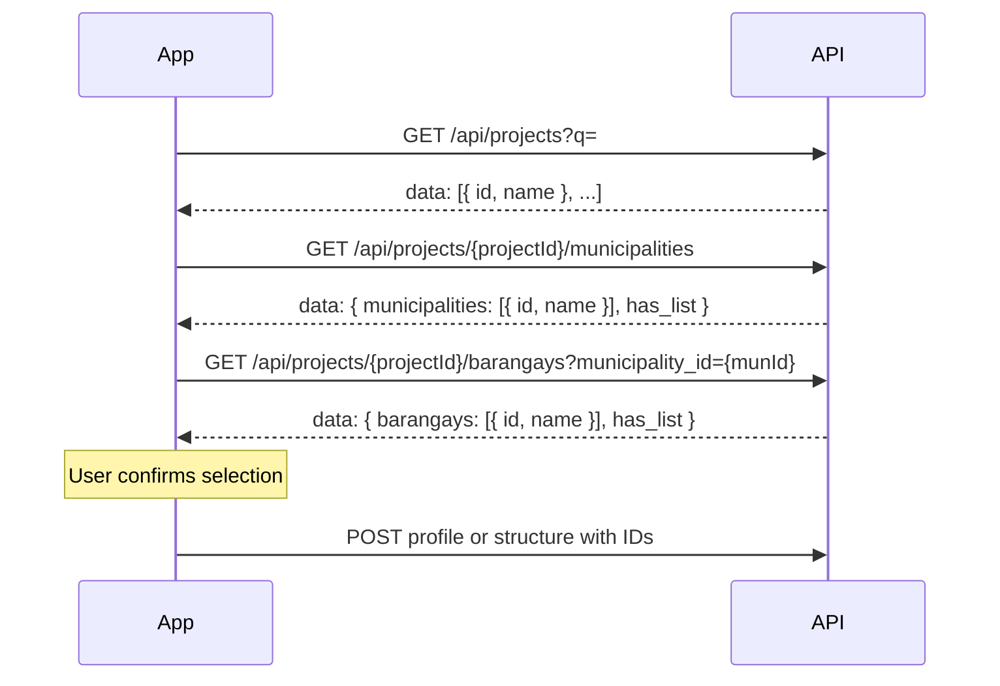

# Mobile App Integration Guide (PAPeR REST API)

Short onboarding for **native or cross-platform apps** (Flutter, React Native, Kotlin, Swift, etc.) that talk to the PAPeR backend over **`/api/*`**.

**Related docs**

| Doc | Use for |
|-----|---------|
| [API_CONTRACT.md](API_CONTRACT.md) | Full field lists, route index, edge cases |
| [API_AUTH.md](API_AUTH.md) | Auth examples and Postman setup |
| **[MOBILE_2FA_GUIDE.md](MOBILE_2FA_GUIDE.md)** | **Dedicated email 2FA verify flow for mobile (challenge → OTP → token), with TS/Dart/Kotlin/Swift snippets and the full error matrix** |
| [postman/README.md](postman/README.md) | Import collection + environment |
| [API_ERROR_CODES.md](API_ERROR_CODES.md) | Stable `error.code` list + mobile actions |
| [api-error-codes.json](api-error-codes.json) | Machine-readable error registry |
| [CHANGES.md](CHANGES.md) | What changed recently (index → monthly `changes/YYYY-MM/`) |
| [MOBILE_EXCHANGES.md](MOBILE_EXCHANGES.md) | Dated mobile ↔ PHP exchange log (requests, decisions, follow-ups) |

**Postman:** `docs/postman/PAPeR-API.postman_collection.json` + `PAPeR-Local.postman_environment.json` (`baseUrl` default `http://eco.local`).

---

## 1. Base URL and prerequisites

1. Point the app at your server root (web server **DocumentRoot** should be `public/`).
2. Default local host: **`http://eco.local`** (`config/app.php` → `base_url`).
3. If the app is in a subfolder, prefix all paths (e.g. `https://example.com/paper/public`).
4. Run migrations once: `php cli/migrate.php` (creates `api_tokens` and schema).
5. Use **HTTPS** in production.
6. **API client gate:** When admins enable it under **System → API Clients → Clients**, every mobile request (including login) must send `X-App-Id` and `X-App-Secret` (create a client there and copy the secret once). Missing/invalid credentials → `UNAUTHORIZED_CLIENT`. Web browser session calls stay exempt. Prefer sending `project_id` on project-scoped calls (query or form body) so Usage analytics can attribute traffic per project.

---

## 1b. API client headers (when gate enabled)

```http
X-App-Id: paper-mobile
X-App-Secret: <from System → API Clients → Clients>
Authorization: Bearer <token>   # after login
X-Device-Model: Samsung SM-S918B   # optional; shown on Security logs / Usage
X-Device-OS: Android 14           # optional; or X-OS-Version
```

Disable a named client under **System → API Clients → Clients** to cut off that app only. Operators use Dashboard / Security logs / Usage analytics (user `#id` and project `#id` filters) to investigate traffic. Device model and OS version are recorded per request (from the headers above, or parsed from `User-Agent` when headers are omitted).

All examples below use `{base}` = your origin with no trailing slash.

---

## 2. Response envelope (always)

Every `/api/*` JSON response:

```json
{
  "success": true,
  "data": { },
  "error": null
}
```

On failure, `success` is `false`, `data` is usually `null`, and `error` has `code` and `message` (and optional `details`).

**Rule:** Read domain payloads from **`data`**, never from the top level. All `/api/*` handlers use the same envelope.

Example unwrap (pseudocode):

```javascript
const body = await response.json();
if (!body.success) throw new Error(body.error?.message ?? 'API error');
const payload = body.data;
```

---

## 3. Authentication flow

### 3.1 Login

```http
POST {base}/api/auth/login
Content-Type: application/json

{
  "username": "fieldtech1",
  "password": "FieldTeam!2026"
}
```

**Success (200)** — store securely:

```json
{
  "success": true,
  "data": {
    "token": "64-char-hex-string",
    "expires_at": "2026-06-17 12:00:00",
    "user": {
      "id": 2,
      "username": "fieldtech1",
      "display_name": "Field Tech",
      "email": "field@example.com"
    }
  },
  "error": null
}
```

### 3.2 Authenticated requests

```http
Authorization: Bearer <token>
```

Send on **every** protected call. Tokens expire after **30 days**; re-login to refresh.

Successful authenticated calls update `api_tokens.last_used_at` (throttled). Admins see recently used tokens on **System → Realtime Dashboard** (API / mobile section). Optional `X-Device-Model` / `X-Device-OS` improve the device column when API client event logging is on.

### 3.3 Session check / logout

| Action | Method | Path |
|--------|--------|------|
| Current user | `GET` | `/api/auth/me` |
| Revoke token | `POST` | `/api/auth/logout` |

`GET /api/auth/me` returns `id`, `username`, `display_name`, `email`, `role_name`, and **`capabilities`** (array of capability keys for the current role; administrators receive all keys).

### 3.4 Email 2FA (when enabled on the server)

> **Dedicated guide:** [MOBILE_2FA_GUIDE.md](MOBILE_2FA_GUIDE.md) — full sequence diagram, error matrix, retry/resend/lockout rules, secure storage checklist, and copy-pasteable client snippets (TypeScript, Dart, Kotlin, Swift).

When `enable_email_2fa` is **on**, `POST /api/auth/login` no longer returns a token directly. Instead, on valid credentials it returns a **pending challenge** (HTTP 200, `success: true`):

```json
{
  "success": true,
  "data": {
    "pending_2fa": true,
    "challenge_id": "f2c4...e9",
    "expires_at": "2026-05-19 09:10:00",
    "email_hint": "ad***@example.com"
  },
  "error": null
}
```

The user receives a 6-digit code by email. Submit it to **`POST /api/auth/2fa/verify`**:

```http
POST {base}/api/auth/2fa/verify
Content-Type: application/json
```

```json
{ "challenge_id": "f2c4...e9", "code": "123456" }
```

Success returns the same shape as a no-2FA login (`data.token`, `expires_at`, `user`). Store the token and continue.

If the user did not receive the email, call **`POST /api/auth/2fa/resend`** with `{ "challenge_id": "..." }` to send a new code on the same challenge (attempts reset).

### 3.5 Login / 2FA failures (handle in UI)

Branch on **`error.code`** (see [API_ERROR_CODES.md](API_ERROR_CODES.md)). Full registry: **`GET /api/meta/error-codes`** (no auth).

| `error.code` | HTTP | When | Mobile action |
|--------------|------|------|---------------|
| `UNAUTHORIZED` | 401 | Invalid credentials | Show "wrong username/password" |
| `PASSWORD_EXPIRED` | 403 | Password policy expiry | Show "contact admin" |
| `RATE_LIMITED` | 429 | Too many attempts (IP throttling) | Backoff and retry login |
| `TWO_FACTOR_NO_EMAIL` | 403 | 2FA on, user has no email | Show "contact admin to set email" |
| `TWO_FACTOR_SEND_FAILED` | 502 | OTP email send failed | Allow retry login or resend |
| `TWO_FACTOR_INVALID_CODE` | 401 | Wrong OTP on verify | Let user re-enter code |
| `TWO_FACTOR_CHALLENGE_EXPIRED` | 410 | Code expired | Restart login |
| `TWO_FACTOR_CHALLENGE_NOT_FOUND` | 404 | Bad / consumed `challenge_id` | Restart login |
| `TWO_FACTOR_LOCKED` | 429 | Too many wrong codes | Restart login |
| `TWO_FACTOR_REQUIRED` | 403 | Server cannot start 2FA for the account (legacy) | Show "contact admin" |

### 3.6 What mobile cannot do via API today

- **Library admin** (create/edit projects, municipalities, barangays) — mostly **web** routes; mobile uses **read** dropdown APIs (§5).
- **CSRF** — not required for Bearer `/api/*` (CSRF applies to browser form POSTs only).

---

## 4. Capabilities and project scope

Access is enforced per **role capability** and **assigned projects**.

### 4.1 Capability keys (by module)

Capabilities are defined in `App/Capabilities.php`. Typical field-app roles need:

| Module | View | Create | Edit | Delete | Other |
|--------|------|--------|------|--------|-------|
| Profile | `view_profiles` | `add_profiles` | `edit_profiles` | `delete_profiles` | `export_profiles` |
| Structure | `view_structure` | `add_structure` | `edit_structure` | `delete_structure` | `export_structure` |
| Grievance | `view_grievance` | `add_grievance` | `edit_grievance` | `delete_grievance` | `change_grievance_status`, `export_grievance` |
| Projects (Library) | `view_projects` | `add_projects` | … | … | — |

**Administrator** bypasses capability checks.

Use **`data.capabilities`** from `GET /api/auth/me` to show or hide menus (e.g. `add_profiles`, `view_grievance`). On **`403`** with `FORBIDDEN`, the user lacks the required capability.

### 4.2 Project scoping

Non-admin users may be limited to projects in **`user_projects`**.

- If the user has **no** project restriction, all accessible projects apply.
- If restricted, `POST`/`GET` with a `project_id` outside the list returns **`403`** with message `Project not allowed for current user`.

Always load allowed projects with `GET /api/projects?q=` and only offer those in pickers.

---

## 5. Location picker sequence (profile & structure)

Use **IDs**, not free-text names, whenever possible.

### 5.1 Flow (recommended)



### 5.2 Endpoints

| Step | Request | Response `data` (typical) |
|------|---------|---------------------------|
| Projects | `GET /api/projects?q=` | `[{ "id": 1, "name": "Sample Project Alpha" }, ...]` |
| Municipalities | `GET /api/projects/{id}/municipalities` | `{ "municipalities": [{ "id", "name" }], "has_list": true }` |
| Barangays | `GET /api/projects/{id}/barangays?municipality_id={munId}` | `{ "barangays": [{ "id", "name" }], "has_list": true }` |

**Legacy:** `?municipality=Name` still works; prefer **`municipality_id`**.

**Validation rule:** For a given `project_id`, the `(municipality_id, barangay_id)` pair must be valid for that project — either via `project_affected_barangays` or via `municipality_projects` + master `barangays` (see API_CONTRACT). Invalid pairs return **`400`** `ValidationError`.

### 5.3 Profile location fields

| Field | Type | Notes |
|-------|------|--------|
| `project_id` | int | Required for location validation |
| `custom_municipality_id` | int | Preferred |
| `custom_barangay_id` | int | Preferred |
| `custom_municipality` | string | Legacy; server resolves or creates municipality (auto-code `MUN-AUTO-{id}`) |
| `custom_barangay` | string | Legacy; resolved against project + municipality |

### 5.4 Structure location fields

| Field | Type | Notes |
|-------|------|--------|
| `project_id` | int | Optional but recommended |
| `municipality_id` | int | With `barangay_id` |
| `barangay_id` | int | Validated like profile |

On **update**, send all three location fields only when replacing location; omit all three to keep existing values.

---

## 6. Profile API (JSON)

Requires Bearer token.

| Action | Method | Path | Capability |
|--------|--------|------|------------|
| List | `GET` | `/api/profile/list?page=1&per_page=15&q=` | `view_profiles` |
| Read | `GET` | `/api/profile/{id}` | `view_profiles` |
| Create | `POST` | `/api/profile/store` | `add_profiles` |
| Update | `POST` | `/api/profile/update/{id}` | `edit_profiles` |
| Delete | `POST` | `/api/profile/delete/{id}` | `delete_profiles` |
| Restore | `POST` | `/api/profile/restore/{id}` | `delete_profiles` (admin restore rules) |
| Structures for profile | `GET` | `/api/profile/{id}/structures` | `view_profiles` |
| Tag search (profile picker) | `GET` | `/api/structure/tag-search?q=&project_id=&municipality_id=&barangay_id=` | `view_structure` |

`GET /api/profile/{id}/structures` returns `structure_classification` and `classification_label` per row. **`GET /api/structure/tag-search`** returns distinct tags for the profile multi-select (includes classification labels).

**Attachment cards:** `GET /api/profile/{id}` includes `attachments[]` (`id`, `title`, `description`, `file_path`, `url`, `sort_order`). Download with Bearer via the `url` (`/serve/profile?subdir=attachments&file=…`). Create/update with **`multipart/form-data`**: `attachment_title[]`, `attachment_description[]`, `attachment_file[]`, optional `attachment_id[]` on update; send `attachment_section=1` when replacing the full card set (omitted cards are deleted). Omitting all attachment fields on update leaves existing cards unchanged. JSON-only create/update does not change cards.

**Content-Type:** `application/json` (or form-urlencoded for simple clients; use **multipart** when uploading attachment cards).

### 6.1 Create example (minimal)

```http
POST {base}/api/profile/store
Authorization: Bearer <token>
Content-Type: application/json
```

```json
{
  "project_id": 1,
  "custom_municipality_id": 3,
  "custom_barangay_id": 12,
  "control_number": "MOBILE-CN-001",
  "first_name": "Maria",
  "middle_name": "Luna",
  "last_name": "Reyes",
  "age": 28,
  "birthday": "1998-01-15",
  "date_of_invitation": "2026-05-01",
  "contacts_person": ["Kamag-anak"],
  "contacts_number": ["09171234567"],
  "structure_ownership_type": "owner",
  "profile_structure_tags": ["TAG-001", "TAG-002"]
}
```

**Read-only contacts directory:** `GET /api/contact/list?q=&entity_type=profile|user&project_id=&page=1&per_page=20` requires **`view_contacts`**. Use to browse numbers; create/update still via profile (or user) store/update payloads below.

**Validation highlights**

- **`project_id` is required** (municipality and barangay must match Library configuration for that project).
- At least one **contact number** required (`contacts_number` array, or `contact_number`, or `contacts` array).
- `full_name` **or** `control_number` required (if not using split names, send `full_name`).
- Minimum age rules apply (`age` / `birthday`).
- `civil_status` / `spouse_name` only apply when `structure_ownership_type` is `owner` (married → spouse).
- Optional **`profile_structure_tags`** (array of strings) must each match an existing structure tag for the profile's **project, municipality, and barangay**. Legacy single **`profile_structure_tag`** is still accepted on write; read responses include both **`profile_structure_tags`** and **`profile_structure_tag`** (first tag).

**Success (201):** `data.id`, `data.profile` (transformed row).

---

## 7. Structure API (multipart)

Structure **create/update** use **`multipart/form-data`**, not raw JSON. **List** and **read** are JSON GETs.

| Action | Method | Path | Capability |
|--------|--------|------|------------|
| List | `GET` | `/api/structure/list?page=&per_page=&q=&project_id=` | `view_structure` |
| Options | `GET` | `/api/structure/options` | `view_structure` / `add_structure` / `edit_structure` |
| Read | `GET` | `/api/structure/{id}` | `view_structure` |
| Create | `POST` | `/api/structure/store` | `add_structure` |
| Update | `POST` | `/api/structure/update/{id}` | `edit_structure` |
| Delete | `POST` | `/api/structure/delete/{id}` | `delete_structure` |
| Next STRID | `GET` | `/api/structure/next-strid` | `add_structure` |
| Find by tag | `GET` | `/api/structure/find-by-tag?tag=&project_id=&municipality_id=&barangay_id=` | `view_structure` |
| Tag search (profile) | `GET` | `/api/structure/tag-search?q=&project_id=&municipality_id=&barangay_id=` | `view_structure` |

### 7.0 List (Structures tab)

```http
GET {base}/api/structure/list?page=1&per_page=15&q=&project_id=1
Authorization: Bearer {token}
```

**Success `data`:** `{ items[], total, page, per_page, total_pages, first_id, last_id, nested }` — same shape as `GET /api/profile/list` / `GET /api/grievance/list`.

Optional filters (same as web Structure list): `municipality_id`, `barangay_id`, `phase_id`, `structure_tag`, `paps_q`, `date_first_visit_from`, `date_first_visit_to`, `tagging_status`, `structure_classification`, `primary_only=1`, plus `sort` / `order` / `columns` / cursor `after_id` / `before_id`. Admins: `show_deleted=with|only`.

List rows include list columns (STRID, owner/PAPS label, tag, project/muni/brgy/phase names, classification + `classification_label`, tagging status, description, etc.). Open detail via `GET /api/structure/{id}` (full tagging fields + images).

### 7.0b Options (pickers)

```http
GET {base}/api/structure/options
Authorization: Bearer {token}
```

**Success `data`:** `tagging_statuses[]` (`code`, `name`, `requires_other_text`, `requires_refusal_reason`, …), `actual_usages[]` (`name`, … — suggestions only), `classifications[]` (`code`, `name`). Use `code` for `tagging_status`. **`actual_usage` is free text** (any string); use `actual_usages` only to power autocomplete. New values saved on create/update are stored for future suggestions. When `requires_other_text` / `requires_refusal_reason` is true, send `tagging_status_other` / `refusal_reason` as on the web form.

### 7.1 Multipart create example

**Form fields (text)**

| Field | Example |
|-------|---------|
| `owner_id` | `42` (optional profile id) |
| `project_id` | `1` |
| `municipality_id` | `3` |
| `barangay_id` | `12` |
| `structure_tag` | `TAG-001` |
| `pn_number` | Optional PN / parcel number text |
| `description` | `Primary residence` |
| `other_details` | Free text |
| `tagging_status` | `tagged` |
| `gps_latitude` | `14.5995` (decimal; for maps) |
| `gps_longitude` | `120.9842` (decimal; for maps) |
| `gps_latitude_text` | `N15°58.209` (optional; original input as entered) |
| `gps_longitude_text` | `E120°9.687` (optional; original input as entered) |

**File fields (repeatable)**

| Field | Purpose |
|-------|---------|
| `tagging_images[]` | Tagging photos |
| `structure_images[]` | Structure photos |

**Success:** `{ "success": true, "data": { "id": 99 } }`

### 7.2 Multipart update example

Same fields as create, plus:

| Field | Purpose |
|-------|---------|
| `tagging_images_remove[]` | Stored path strings to remove from JSON gallery |
| `structure_images_remove[]` | Same for structure images |

Include `project_id`, `municipality_id`, `barangay_id` **only** when changing location.

### 7.3 Displaying images

`GET /api/structure/{id}` returns `tagging_images` and `structure_images` as **JSON strings** of stored paths (e.g. `/uploads/structure/tagging/filename.jpg`).

Serve endpoint (Bearer or session auth; requires `view_structure`):

```http
GET {base}/serve/structure?subdir=tagging&file=example.jpg
GET {base}/serve/structure?subdir=images&file=example.jpg
```

- `subdir` must be `tagging` or `images`.
- `file` is the basename only (alphanumeric, `_`, `-`, `.`).
- Parse each path from the JSON array: e.g. `/uploads/structure/tagging/photo.jpg` → `subdir=tagging`, `file=photo.jpg`.

---

## 8. Grievance API (JSON)

| Action | Method | Path | Capability |
|--------|--------|------|------------|
| List | `GET` | `/api/grievance/list?...` | `view_grievance` |
| Read | `GET` | `/api/grievance/{id}` | `view_grievance` |
| Dashboard | `GET` | `/api/grievance/dashboard?project_id=&date_from=&date_to=` | `view_grievance` |

Dashboard `data.closedByStage` groups **closed** grievances by last In Progress stage before closure. For this widget only, `date_from` / `date_to` filter by **closure effective date** (`closed_at`), not date recorded. `data.closedInRangeTotal` is the total closed count in that range.

`GET /api/grievance/{id}` includes `closed_at`, `closed_at_progress_level`, and `closure_summary` (`closed_at`, `progress_level`, `progress_level_name`, `closed_from_open`) when the ticket is currently closed.
| Create | `POST` | `/api/grievance/store` | `add_grievance` |
| Update | `POST` | `/api/grievance/update/{id}` | `edit_grievance` |
| Delete | `POST` | `/api/grievance/delete/{id}` | `delete_grievance` |

Field changes on update are written to web **Activity History** with the same from→to detail as browser edits, plus `source: api`. Prefer **`status-update`** for status/notes; use **update** for registration fields.

### 8.1 Options library (required when tables are non-empty)

After install, run `php database/seeders/seed_grievance_options.php` (Playwright E2E does this automatically).

When lookup tables have rows, create **must** include:

| Field | Type | Notes |
|-------|------|--------|
| `date_recorded` | datetime | Required; official grievance registration date/time |
| `grm_channel_id` | int | Or first id from `grm_channel_ids` |
| `municipality_id` | int | Required; validated against project (PAPS: from profile) |
| `barangay_id` | int | Required; validated against project + municipality |
| `preferred_language_ids` | int[] | At least one |
| `grievance_type_ids` | int[] | At least one |
| `grievance_category_ids` | int[] | Optional |

**`GET /api/grievance/options`** (Bearer; requires grievance view/add/edit). Pass **`?project_id=`** (the grievance’s project) when loading GRM channels, preferred languages, and in-progress stage pickers. Response `data` includes `grm_channels`, `grm_channels_scope`, `preferred_languages`, `preferred_languages_scope`, `grievance_types`, `grievance_categories`, `vulnerabilities`, `respondent_types`, `respondent_type_categories`, `progress_levels`, `progress_levels_scope`.

- **Standard option rows** (`grm_channels`, `preferred_languages`, etc.): `id`, `name`, `description`, `sort_order`, `project_id` (null for global defaults).
- **`grm_channels` / `preferred_languages`:** same scoping as progress levels — project-specific when initialized, otherwise global defaults only. Selected IDs must belong to the resolved set for the grievance’s `project_id`.
- **`respondent_types`** (flat, backward compatible): each row adds `type` (`Directly Affected` | `Indirectly Affected` | `Others`), optional `type_specify`, `guide`, `description`.
- **`respondent_type_categories`** (recommended for mobile UX): three groups matching the web form — `directly_affected`, `indirectly_affected`, `others`. Each has `label`, `type`, `allow_other_specify` (true for `others`), and `items[]` (same shape as `respondent_types` rows). When `others` is selected, also send `respondent_type_other_specify` on grievance create/update if the user enters free text.
- **`progress_levels`:** `id`, `name`, `project_id`, `days_to_address`, `sort_order`. When `project_id` is set: returns **only** that project’s stages if initialized, otherwise **only** global defaults (same as web). Without `project_id`, returns global defaults only — not all projects’ levels.
- **`*_scope` fields** (`progress_levels_scope`, `grm_channels_scope`, `preferred_languages_scope`): `project` when the project has its own rows; `default` when global defaults are used (including uninitialized projects).

### 8.2 Create example

```http
POST {base}/api/grievance/store
Authorization: Bearer <token>
Content-Type: application/json
```

```json
{
  "project_id": 1,
  "date_recorded": "2026-06-16T14:00:00",
  "municipality_id": 1,
  "barangay_id": 1,
  "grm_channel_id": 1,
  "preferred_language_ids": [1],
  "grievance_type_ids": [1],
  "grievance_category_ids": [1],
  "respondent_first_name": "Juan",
  "respondent_last_name": "Dela Cruz",
  "gender": "Male",
  "mobile_number": "09171234567",
  "description_complaint": "Concern regarding access road.",
  "desired_resolution": "Schedule coordination with barangay.",
  "status": "open"
}
```

**Initial status on create:** `POST /api/grievance/store` may also send `status`, `progress_level`, `status_note` (or `note`), and `status_effective_at`; multipart requests may include `status_attachments[]`. The created grievance and its first status-history row use the same status/stage/effective date. `progress_level` is required for `in_progress` and must come from `GET /api/grievance/options?project_id=...`. Non-default initial status/history requires `edit_grievance` or `change_grievance_status` in addition to `add_grievance`. If `status_effective_at` is omitted, it defaults to the required `date_recorded`.

**Registration attachment cards** (title / description / file — distinct from status-history files): multipart on `store` / `update` with `attachment_title[]`, `attachment_description[]`, `attachment_file[]`, optional `attachment_id[]` on update. Send `attachment_section=1` when the client is managing the full card set (cards not listed are soft-deleted). Omitting all card fields on update leaves cards unchanged. `GET /api/grievance/{id}` returns `attachments[]` with `url` → `/serve/grievance-card-attachment?id=` (Bearer or session).

**Later status / progress:** Use **`POST /api/grievance/status-update/{id}`** for status changes and note-only updates (recommended). Always writes status history, same as web. Read history via **`GET /api/grievance/status-log/{id}`**.

| Field | Type | Notes |
|-------|------|--------|
| `status` | string | `open` \| `in_progress` \| `closed`. Defaults to current when omitted on status-update. |
| `progress_level` | int | Required when moving to `in_progress` with a new stage; omit to keep current level on note-only. |
| `status_note` | string | Note for this status/stage. Alias: `note`. |
| `status_effective_at` | datetime | When the change occurred (paper workflow). Note-only: history only, does not reset SLA. |
| `status_attachments[]` | file | Multipart only. Images or PDF (same types as web). |

**Example — note only (same status):**

```http
POST {base}/api/grievance/status-update/42
Authorization: Bearer <token>
Content-Type: application/json
```

```json
{
  "status": "in_progress",
  "progress_level": 2,
  "status_note": "Called respondent; waiting for barangay schedule.",
  "status_effective_at": "2026-06-16T14:30"
}
```

**Example — read status history:**

```http
GET {base}/api/grievance/status-log/42
Authorization: Bearer <token>
```

Response `data.items[]`: `id`, `status`, `status_label`, `progress_level`, `progress_level_name`, `note`, `effective_at`, `created_at`, `created_by_name`, `attachments[]` (`label`, `url`).

**Alternative:** `POST /api/grievance/update/{id}` also records status history when `status`/`progress_level` change or when `status_note` / attachments are included. Capability `change_grievance_status` applies on web; API status-update accepts `edit_grievance` or `change_grievance_status`.

### 8.3 Respondent autocomplete (optional UX)

| Endpoint | Min query |
|----------|-----------|
| `GET /api/respondents/first-names?q=` | 3 chars on `q` |
| `GET /api/respondents/middle-names?first_name=&q=` | 3 chars on `first_name` |
| `GET /api/respondents/last-names?first_name=&q=` | 3 chars on `first_name` |
| `GET /api/respondents/latest-details?first_name=&last_name=` | 3 chars on `first_name` |

Requires grievance view/add/edit capability.

---

## 9. Dashboard and notifications (optional)

| Endpoint | Purpose |
|----------|---------|
| `GET /api/dashboard` | Main KPI widgets: `data.profile`, `data.structure`, `data.grievance`, `data.users` |
| `GET /api/grievance/dashboard` | Grievance-specific charts + escalation rows |
| `GET /api/notifications` | In-app notification list |
| `GET /api/history?entity_type=profile&entity_id=1` | Audit history sidebar data |

---

## 10. Suggested app architecture

1. **Config:** `BASE_URL` build-time or env (never hard-code production).
2. **Auth store:** Secure storage for Bearer token + `expires_at`; refresh before expiry.
3. **API client:** Single module that unwraps envelope, attaches `Authorization`, maps HTTP codes to user messages.
4. **Offline (optional):** Queue creates with local IDs; replay when online; handle `409`/validation errors.
5. **Pickers:** Cache `projects` → `municipalities` → `barangays` per project session.
6. **Uploads:** Use platform multipart APIs for structure images; show upload progress.
7. **Testing:** Import Postman collection; run `npm run test:e2e:api:headless` for all `/api/*` routes (Bearer envelope + CRUD smoke), or `npm run test:e2e:full:headless` for UI + API regression on the same host.

---

## 11. Quick checklist before release

- [ ] `php cli/migrate.php` on server
- [ ] Grievance options seeded if using grievance module
- [ ] 2FA disabled for API-only accounts **or** document web-only login
- [ ] HTTPS + certificate pinning (recommended)
- [ ] Token stored in Keychain / Keystore / EncryptedSharedPreferences
- [ ] Handle `403` / `401` globally (logout + re-login)
- [ ] Project picker respects `user_projects`
- [ ] Profile/structure location uses **IDs** from chained GETs
- [ ] Structures tab uses **`GET /api/structure/list`** (not only profile-linked structures)
- [ ] Structure uses **multipart** for images
- [ ] Do not rely on removed profile questionnaire fields (pre–migration 037)

---

## 12. Changelog pointer

See [CHANGES.md](CHANGES.md) (monthly files under [changes/](changes/)) and [DevelopmentHistory/](DevelopmentHistory/) for dated API/schema changes (e.g. structure `project_id` / `municipality_id` / `barangay_id`, municipality `code` requirement).
