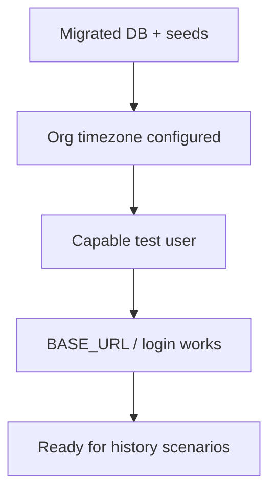
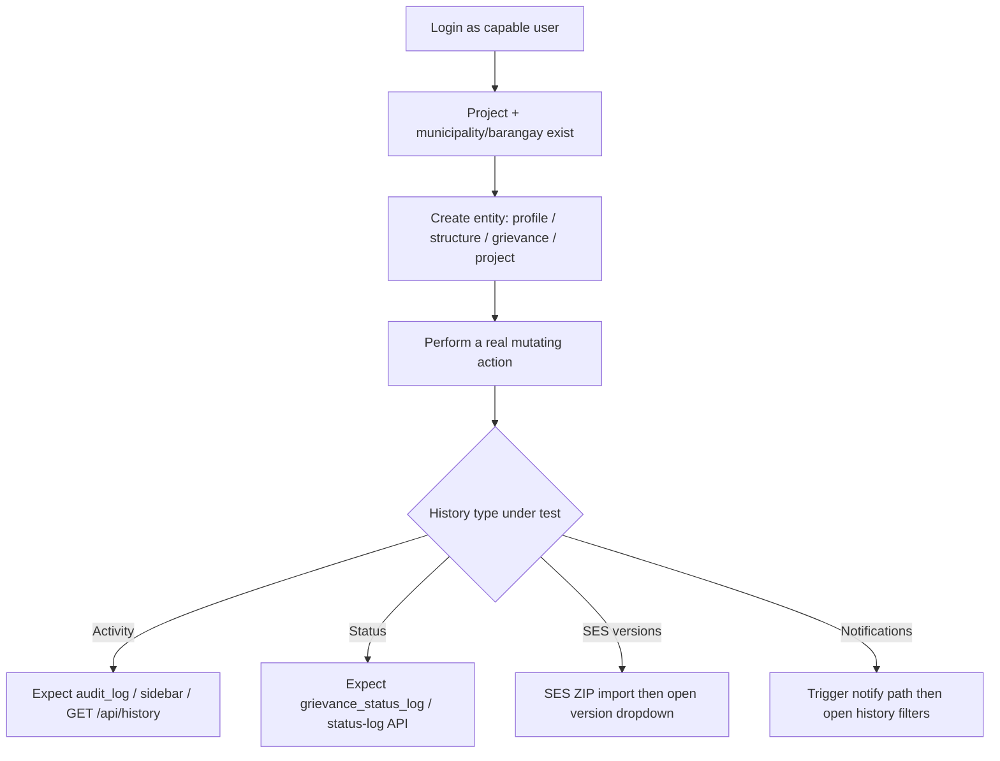
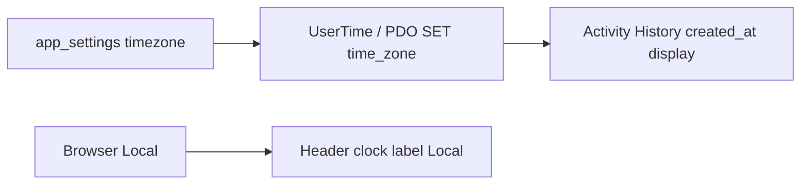

# PAPeR – Testing History prerequisites guide

What must be true **before** you can validly test Activity History, Status History, SES version history, and notification history.

**Related:** [TEST_STRATEGY.md](TEST_STRATEGY.md), [AUTOMATED_FUNCTIONAL_TEST_DESIGN.md](AUTOMATED_FUNCTIONAL_TEST_DESIGN.md), [GLOSSARY.md](GLOSSARY.md), [QA_ESCALATION_REGRESSION.md](QA_ESCALATION_REGRESSION.md), DEVELOPMENTGUIDE §4.6 (audit / history).  
**After a significant run:** log results under [test-results/](test-results/README.md).

---

## 1. Scope — which “history”?

| Kind | Storage | Primary UI | Primary API / check |
|------|---------|------------|---------------------|
| **Activity History** | `audit_log` | Entity view sidebar (`partials/history_sidebar.php`) | `GET /api/history?entity_type=&entity_id=` |
| **Grievance Status History** | `grievance_status_log` (+ optional status attachments) | Grievance view status panel | `GET /api/grievance/status-log/{id}` |
| **Structure tagging status history** | Derived from `audit_log` (`status_changed` on tagging fields) | Structure view | Activity History + structure helpers |
| **SES version history** | `profile_socio_versions` + `profile_socio_version_sections` | Profile → Socio Economic tab | `GET /api/profile/{id}/socio-economic` |
| **Notification history** | `notifications` | Notifications list / filters | In-app notification pages (not `audit_log`) |

This guide does **not** cover password history (`user_password_history`) or DevelopmentHistory JSON docs.

---

## 2. Environment prerequisites

Complete these once per test environment:

| # | Prerequisite | Why |
|---|--------------|-----|
| 1 | App reachable at a known host | Playwright / browser need a stable origin |
| 2 | `php cli/migrate.php` applied (incl. **018** `audit_log`, grievance status, **084** SES) | History tables must exist |
| 3 | `php database/seeders/seed_grievance_options.php` (for grievance status / levels) | Status History needs progress levels |
| 4 | Org **timezone** set (System → General) | Activity History `created_at` uses system TZ (`UserTime::formatSystem`) |
| 5 | Test user with correct **capabilities** (see §4) | `GET /api/history` enforces view caps per entity |
| 6 | Optional: `.env.playwright` with `BASE_URL`, `ADMIN_USER`, `ADMIN_PASS` | Automated history E2E |

**Playwright:** `BASE_URL` must be configurable (never hard-code production). See ADR-0010.



---

## 3. Data prerequisites (happy path)

History rows are **side effects of mutations**. Empty history usually means no prior write, not a UI bug.



### 3.1 Minimum seeds by scenario

| Scenario | Need at least |
|----------|----------------|
| Profile Activity History | Project + valid location + create/edit profile |
| Structure Activity / tagging history | Project + profile (owner) + create/edit structure |
| Grievance Activity History | Project + grievance options/levels + create/edit grievance (field change) |
| Grievance Status History | Same + status/level update (`change_grievance_status` where required) |
| Library / project Activity History | Create or edit project (`view_projects`) |
| SES version history | Profile with matching **control_number** + SES ZIP import (`import_socio_economic`) |
| Notification history | Preferences that allow the event + an action that enqueues a notification |

---

## 4. Capability prerequisites

`GET /api/history` maps entity → capability:

| `entity_type` | Required capability |
|---------------|---------------------|
| `profile` | `view_profiles` |
| `structure` | `view_structure` |
| `grievance` | `view_grievance` |
| `project` | `view_projects` |

Also enforce **project scope** (`UserProjects`) when opening the entity or reading SES. Administrator bypasses capability checks.

Status updates additionally need mutate / `change_grievance_status` as implemented on the route.

---

## 5. Action → expected history matrix

| Action | Activity History (`audit_log`) | Status History | Notes |
|--------|--------------------------------|----------------|-------|
| Create profile / structure / grievance / project | `created` (typical) | Grievance may also get initial status log row | |
| Edit fields (web) | `updated` with field **from → to** when diffs exist | — | No-op save → often no new activity row |
| `POST /api/grievance/update/{id}` | Same field diffs + `source: api` in changes | — | Aligns with web via `GrievanceFieldChanges` |
| Grievance status / level change | Often `status_changed` / related activity | New `grievance_status_log` row | Escalation timer: note-only ≠ segment restart |
| Structure tagging status change | `status_changed` style entries | Tagging history UI | |
| SES ZIP import | Batch `AuditLog` `socio_economic_import` | — | Per-profile **SES versions** only if sections changed |
| Soft delete / restore | As implemented on module | — | Confirm entity still viewable for history API |

---

## 6. Timezone and clocks



| Surface | Clock |
|---------|--------|
| Activity History timestamps | **System / org** timezone |
| Header clock | Browser **Local** |
| Business dates (`date_recorded`, `effective_at`) | Business formatting rules (see DEVELOPMENTGUIDE) |

**Automated check:** `npm run test:e2e:activity-history-timezone:fast`  
(`tests/e2e/activity-history-timezone.spec.ts`)

---

## 7. How to verify

### 7.1 Manual

1. Open the entity view (profile / structure / grievance / library project).  
2. Confirm Activity History sidebar lists expected actions after a mutation.  
3. For grievances, confirm Status History panel updates on status/level change.  
4. For SES, import a ZIP then use the version dropdown + change highlights.

### 7.2 API

```http
GET /api/history?entity_type=profile&entity_id={id}&page=1&per_page=20
Authorization: Bearer {token}   # or session cookie
```

- Valid `entity_type`: `profile` | `structure` | `grievance` | `project`  
- Response uses API envelope; items include `action`, `changes`, `created_at` (system-formatted), `created_by_name`

```http
GET /api/grievance/status-log/{id}
```

### 7.3 Automated (examples)

| Focus | Command / spec |
|-------|----------------|
| Activity History timezone | `npm run test:e2e:activity-history-timezone:fast` |
| Grievance create → status log | `tests/e2e/grievance/grievance-create-initial-status.spec.ts` |
| Notification history filters | `tests/e2e/notifications/notifications.spec.ts` (U/F cases) |
| History usable on mobile shell | `tests/e2e/responsive/mobile-tablet-shell.spec.ts` |
| SES versions / previous_value | `npm run test:e2e:socio-economic:fast` |

Prefer Philippine-context fixtures (names, mobile formats) per test design policy.

---

## 8. Common false failures

| Symptom | Likely cause |
|---------|----------------|
| Empty Activity History after “save” | No field actually changed (or CSRF/auth failure) |
| `GET /api/history` 403 | Missing view capability or wrong user |
| `GET /api/history` 404 | Soft-deleted / missing entity, or bad id |
| Wrong timestamps | Org timezone not set; comparing to browser Local |
| Status History missing | Used note-only update; or missing `change_grievance_status` |
| SES no new version | Identical section rows (unchanged) or unmatched `control_number` |
| History after truncate | `audit_log` cleared by `truncate_fresh_install` — re-create entities |
| API vs web mismatch on grievance | Older client expecting top-level fields — use envelope `data` |

---

## 9. Quick checklist (copy for test plans)

- [ ] DB migrated + grievance options seeded (if testing grievance status)  
- [ ] Org timezone known  
- [ ] User has view (+ mutate) capabilities and project access  
- [ ] Entity created in that project  
- [ ] Mutation performed (real field / status / SES import change)  
- [ ] Verified via UI sidebar **and/or** `/api/history` / status-log / SES API  
- [ ] For automation: `BASE_URL` + credentials configured  

---

## Maintenance

When history shape or APIs change (`AuditLog`, status log, SES versions), update this guide, [API_CONTRACT.md](API_CONTRACT.md) if integrator-facing, Help on entity view pages, and the monthly CHANGES entry.
