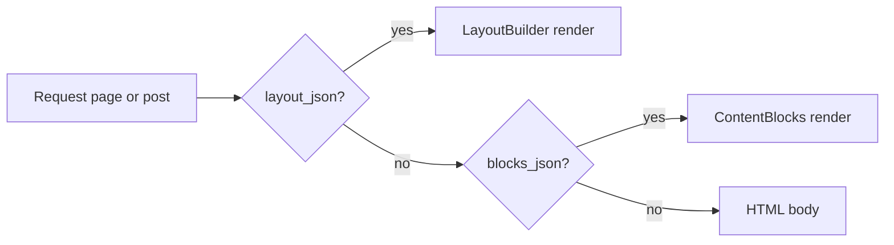
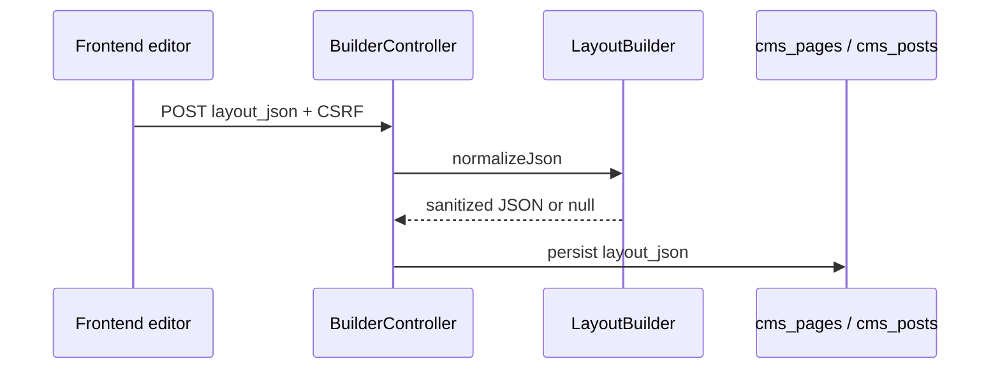

# Simple CMS – UML (Mermaid)

## Public render order

```mermaid
flowchart LR
  A[Request page or post] --> B{layout_json?}
  B -->|yes| C[LayoutBuilder render]
  B -->|no| D{blocks_json?}
  D -->|yes| E[ContentBlocks render]
  D -->|no| F[HTML body]
```

## Visual builder save

```mermaid
sequenceDiagram
  participant E as Frontend editor
  participant W as BuilderController
  participant L as LayoutBuilder
  participant D as cms_pages / cms_posts
  E->>W: POST layout_json + CSRF
  W->>L: normalizeJson
  L-->>W: sanitized JSON or null
  W->>D: persist layout_json
```

Admin UI lives under `/admin`. Public URLs: `/p/{slug}`, `/blog`, permalinks.
