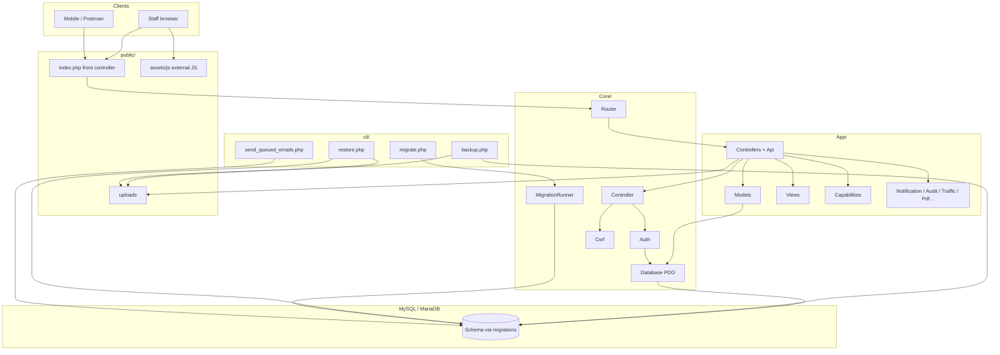
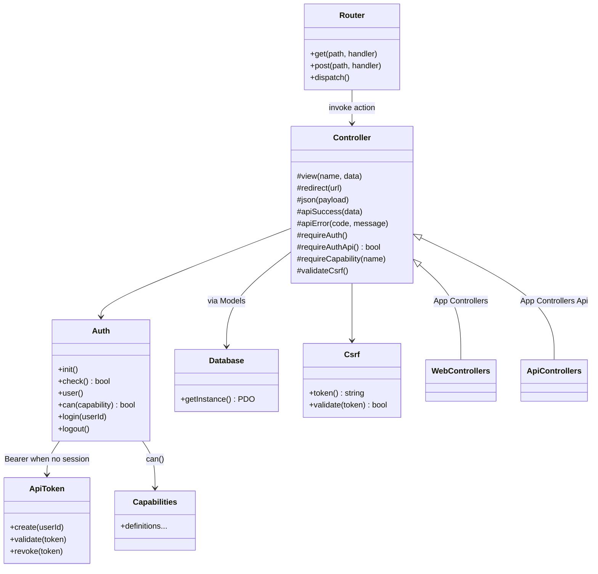
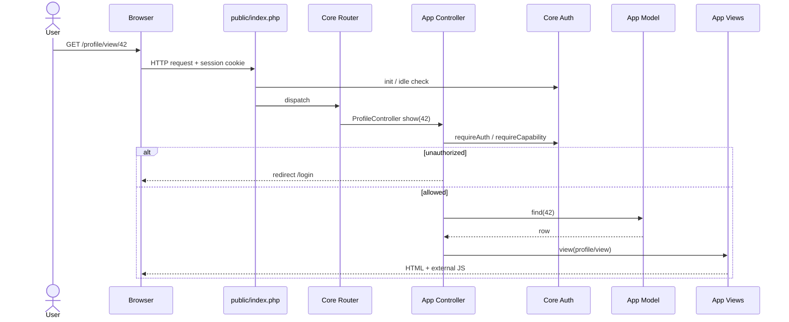
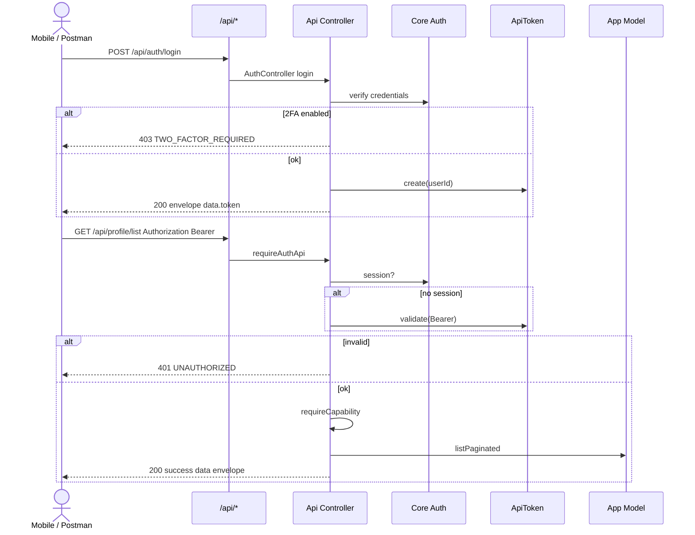
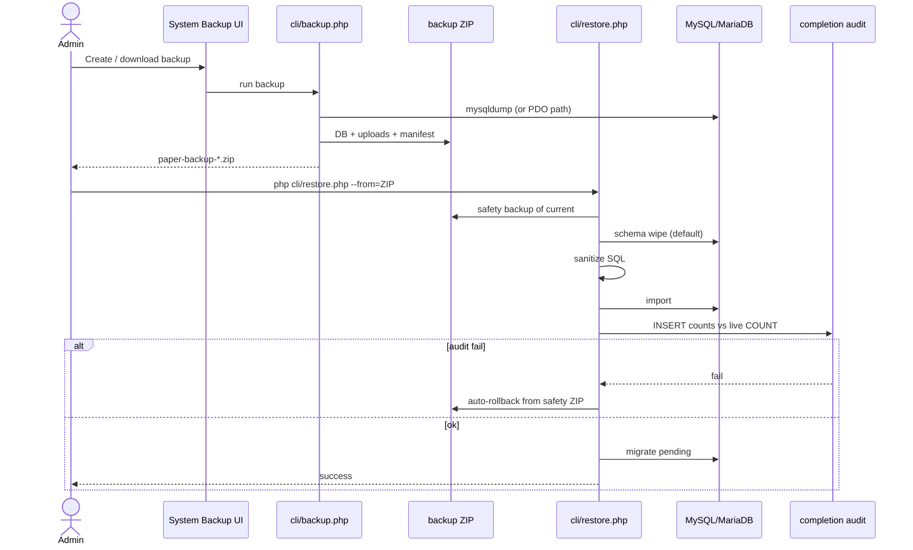
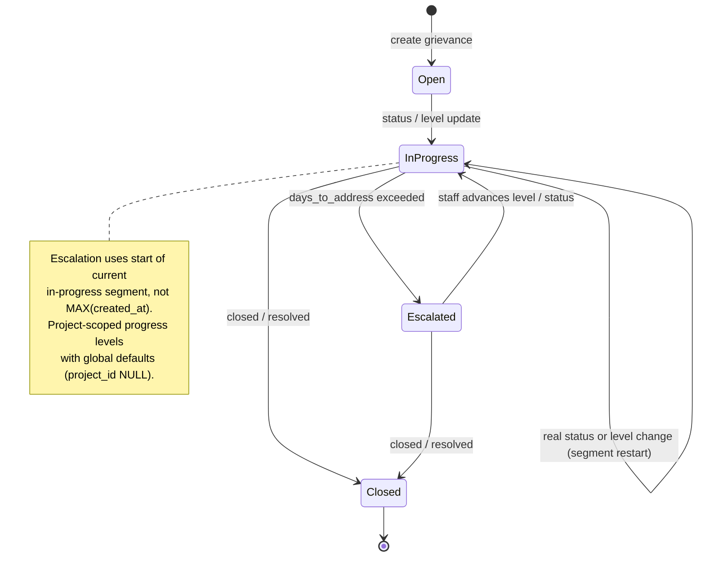
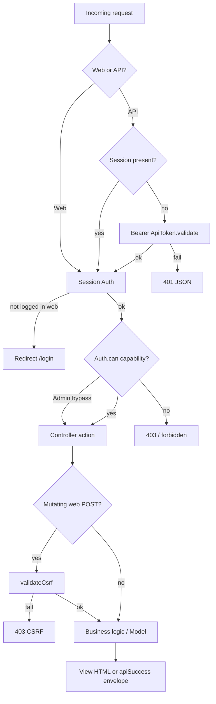
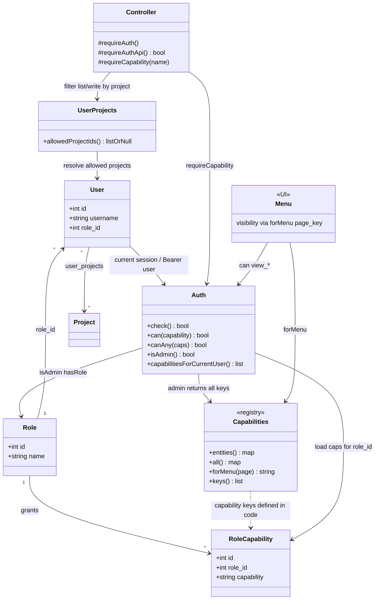
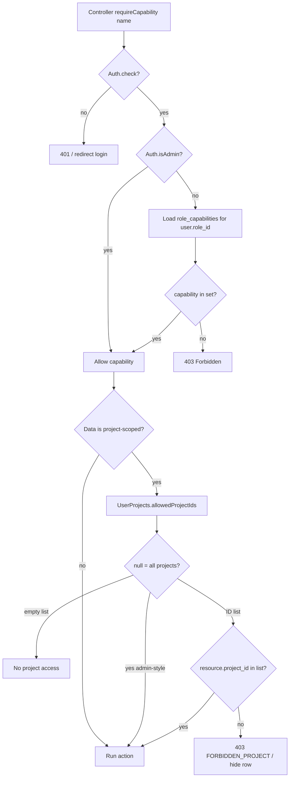

# PAPeR – UML diagrams

Behavioral and structural views of the application (not the database). For tables and FKs see **[ERD.md](ERD.md)**. For *why* choices were made see **[adr/](adr/README.md)**. Living how-to: **[DEVELOPMENTGUIDE.md](DEVELOPMENTGUIDE.md)**.

**Live diagrams:** [`/dev-help/#uml`](../dev-help/) — keep `dev-help/assets/uml-diagrams.js` in sync with this file.  
**SES ZIP import (feature UML):** [UML_SES_IMPORT.md](UML_SES_IMPORT.md) · live [`/dev-help/#ses-uml`](../dev-help/).

Diagrams use Mermaid (`flowchart`, `classDiagram`, `sequenceDiagram`, `stateDiagram-v2`). They intentionally omit every controller/model; prefer durable architecture over a complete inventory. **RBAC** is covered in [§8](#8-rbac--roles-capabilities-project-scope).

---

## 1. Component / package view

---

## 2. Core class sketch

---

## 3. Sequence — web page request

---

## 4. Sequence — API Bearer auth

---

## 5. Sequence — backup and CLI restore

See [ADR-0008](adr/0008-zip-backup-cli-restore.md).

---

## 6. State — grievance progress (simplified)

Manual QA: [QA_ESCALATION_REGRESSION.md](QA_ESCALATION_REGRESSION.md).

---

## 7. Activity — authorization check

---

## 8. RBAC — roles, capabilities, project scope

PAPeR uses **role → capability** grants (not role-only checks), with **Administrator bypass** and optional **project scoping** via `user_projects`. See [ADR-0007](adr/0007-role-capabilities.md) and [CAPABILITY_MATRIX.md](CAPABILITY_MATRIX.md).

### 8.1 Class / structure

### 8.2 Decision flow — `Auth::can` + project scope

**Notes**

- Capability strings are defined in `App\Capabilities` and stored per role in `role_capabilities`.  
- Menus use the same keys (`Capabilities::forMenu`).  
- Web and API share `Auth::can`; API additionally uses Bearer when no session (ADR-0004).  
- Project scope is a **second gate** after capability (not a substitute for it).

---

## Maintenance

When routing, auth, restore, escalation, or **RBAC** semantics change:

1. Update the relevant Mermaid block here and in `dev-help/assets/uml-diagrams.js`.
2. Note it in the current month’s [changes](changes/) entry.
3. Prefer linking to ADRs / API contract / [CAPABILITY_MATRIX.md](CAPABILITY_MATRIX.md) over duplicating field catalogs into UML.
