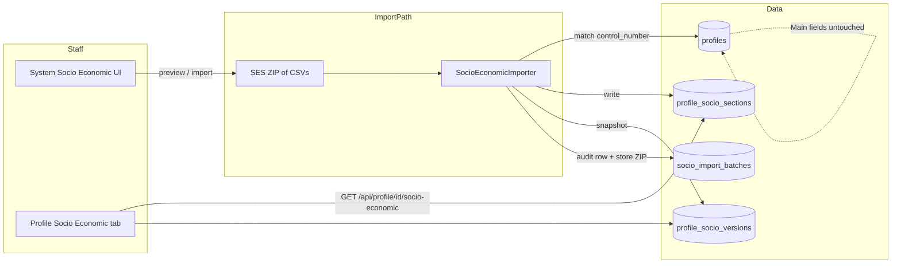
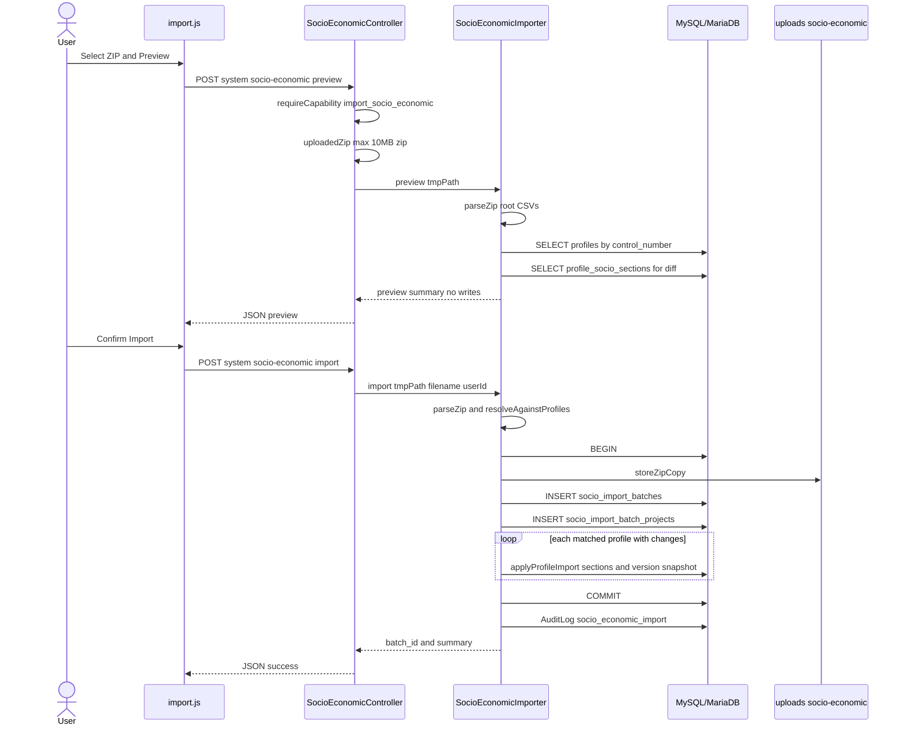
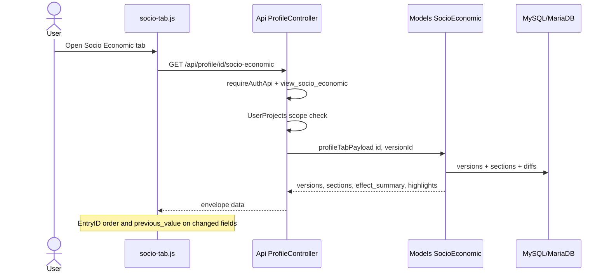
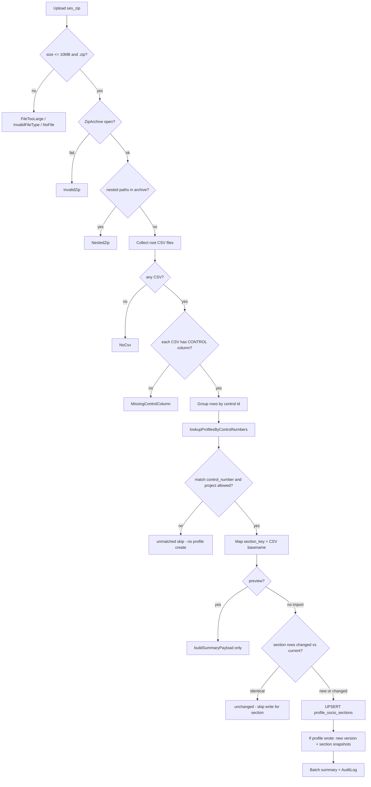
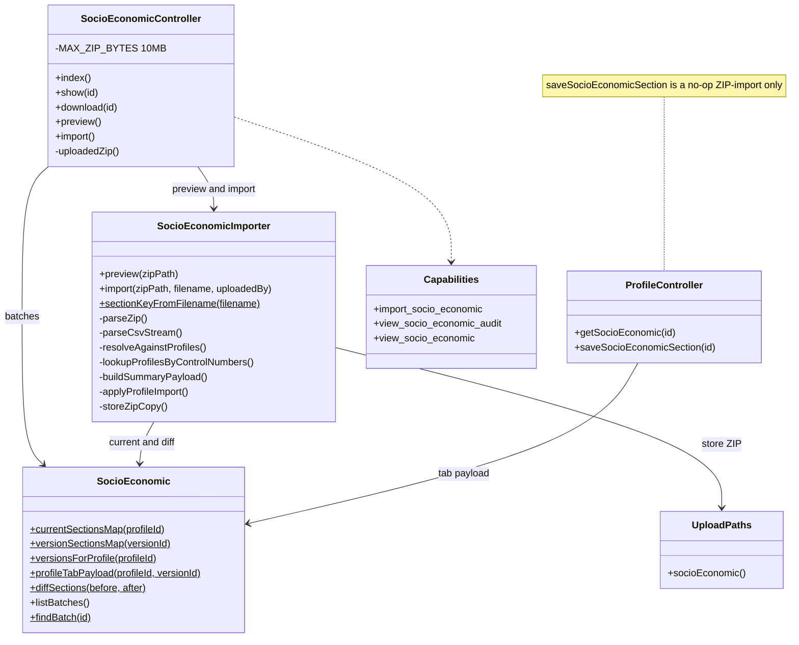
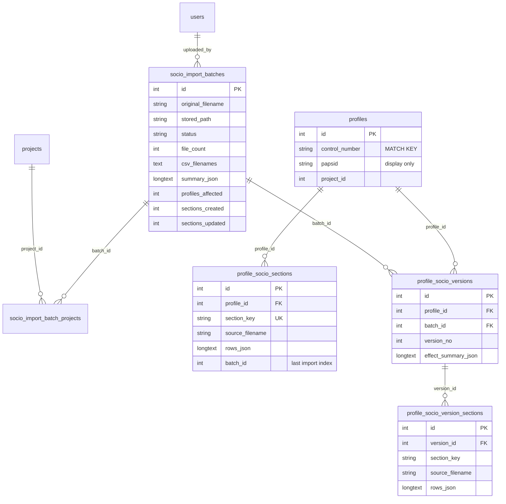
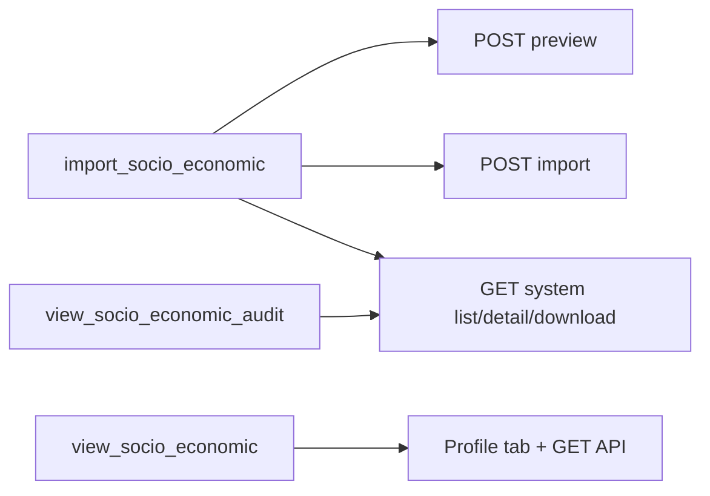

# PAPeR – UML: PAPS Socio-Economic (SES) ZIP import

Feature-focused diagrams for **System → Socio Economic** import and the **Profile → Socio Economic** tab.

**Live diagrams:** [`/dev-help/#ses-uml`](../dev-help/) — sources in `dev-help/assets/ses-uml-diagrams.js`.  
**Related:** migration `084`, [ERD.md §6 SES import](ERD.md) (RAP is §7, separate), [GLOSSARY.md](GLOSSARY.md) (SES), Help `socio-economic`, [CAPABILITY_MATRIX.md](CAPABILITY_MATRIX.md), E2E `tests/e2e/socio-economic-ses.spec.ts`.

---

## Critical rules (read first)

| Rule | Detail |
|------|--------|
| **Match key** | CSV **CONTROL ID** / Control Number / CONTROL_ID → `profiles.control_number` (exact), not soft-deleted |
| **PAPSID** | Display label in summaries only — **not** used for matching |
| **Main profile** | Import **never** creates profiles and **never** updates Main fields (name, contacts, location, …) |
| **Scope** | Only profiles in `UserProjects::allowedProjectIds()` for the importer |
| **ZIP** | Max **10 MB**; root-level `*.csv` only; nested folders → `NestedZip` |
| **Write path** | Web preview/import only (session + CSRF). Profile API is **read-only** for SES |

---

## 1. Context — where SES sits



---

## 2. Sequence — preview then import



---

## 3. Sequence — profile tab read



---

## 4. Activity — validation, match, write



---

## 5. Class sketch



---

## 6. Data model (as implemented)

Version sections are **JSON snapshots** keyed by `section_key` — there is **no** FK from `profile_socio_version_sections` to `profile_socio_sections.id`.



**Logical match (not a DB FK):**

```text
CSV CONTROL ID  ──equals──►  profiles.control_number
```

Batch / section columns above match migration **084** (additional skip/unmatched counters and `error_message` on batches are omitted from the diagram for clarity).
---

## 7. Capabilities



Index/show/download: `view_socio_economic_audit` **or** `import_socio_economic`.  
Preview/import: **`import_socio_economic`** required.

---

## 8. Error codes (importer / controller)

| Code | Meaning |
|------|---------|
| `FileTooLarge` | Over 10 MB |
| `NoFile` | Missing upload |
| `InvalidFileType` | Not `.zip` / rejected magic |
| `InvalidZip` | Cannot open archive |
| `NestedZip` | Entries not at ZIP root |
| `NoCsv` | No root CSVs |
| `MissingControlColumn` | CSV lacks CONTROL column |
| `ImportFailed` | Transaction / unexpected failure |

Non-fatal: empty control cells skipped; unmatched controls listed; identical sections unchanged.

---

## Maintenance

When SES import behaviour changes, update this file **and** `dev-help/assets/ses-uml-diagrams.js`, plus Help / CHANGES as needed. Keep [ERD.md](ERD.md) SES inventory aligned (no false `section_id` FK).
